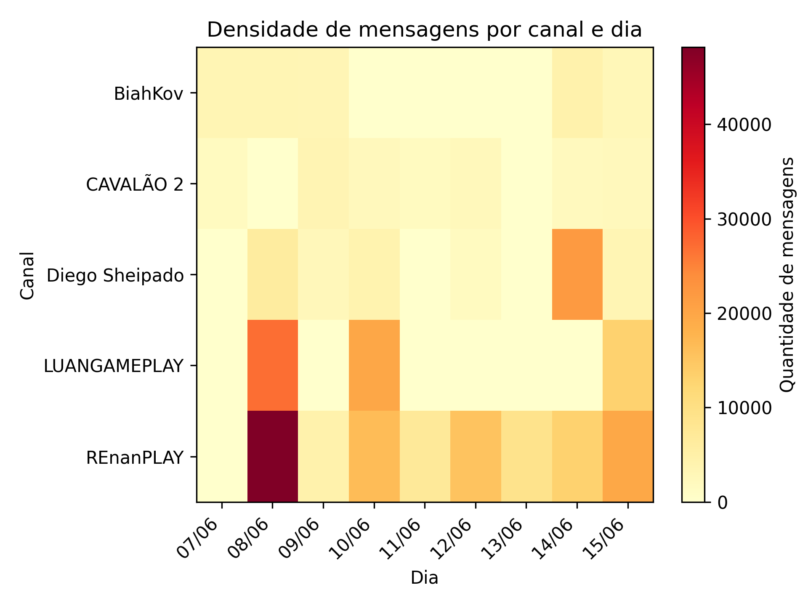
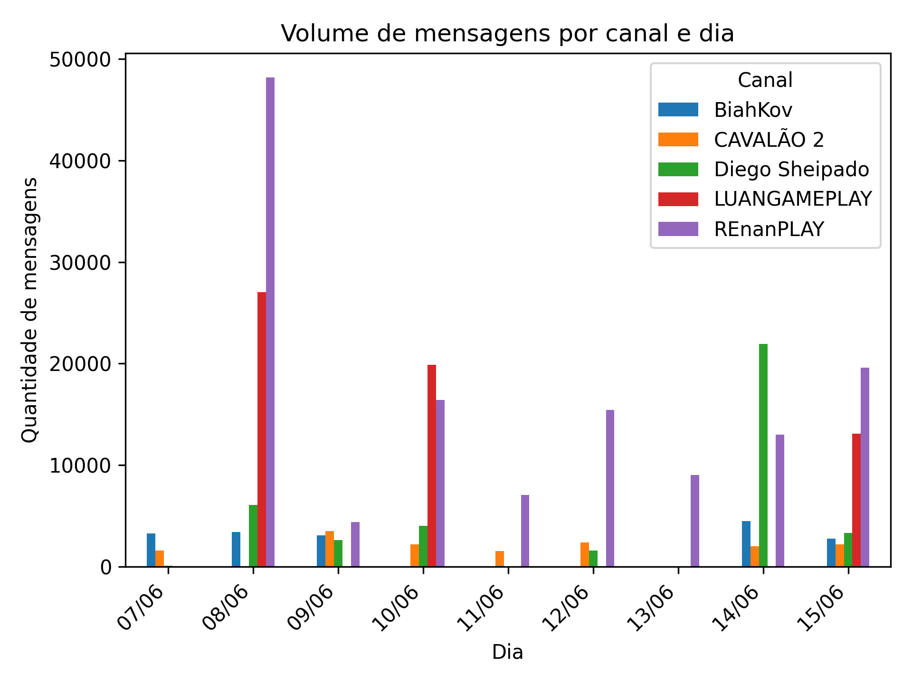
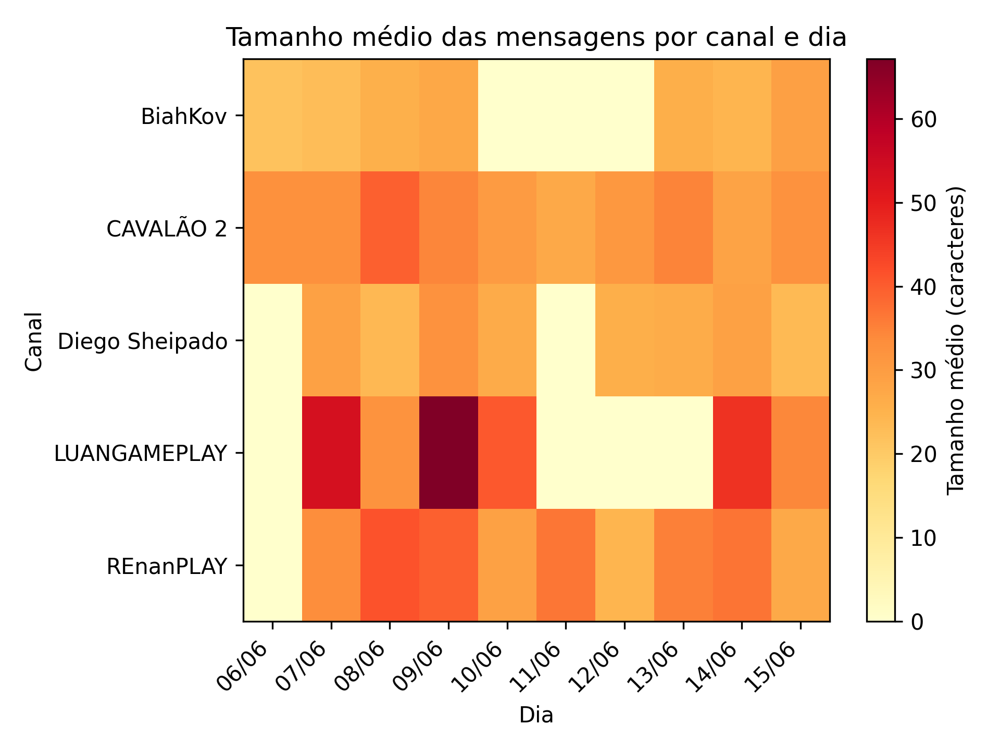
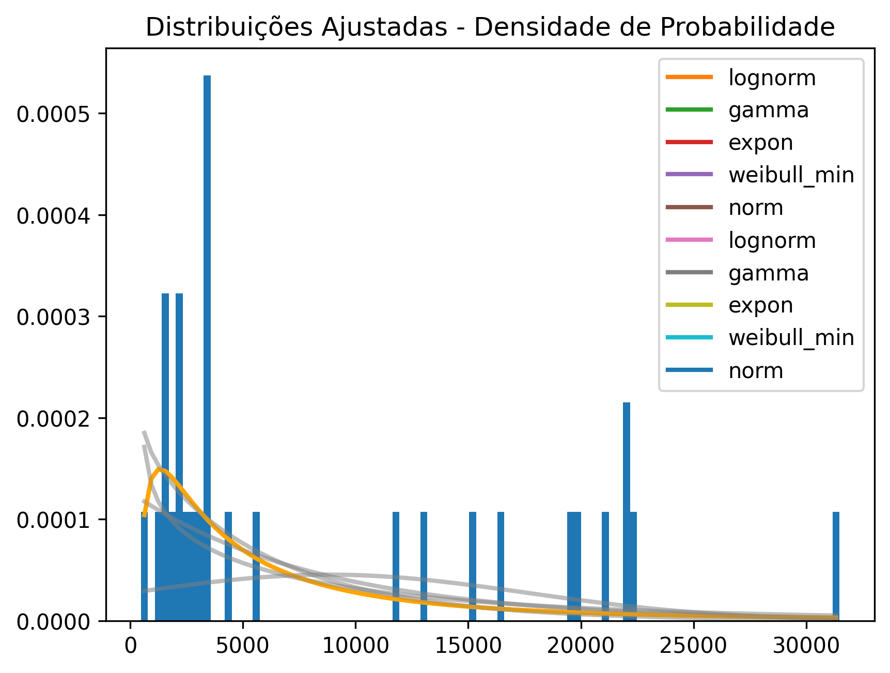

# Análise Exploratória (de Chats de Transmissões ao Vivo no Youtube)

## 1. Releitura dos objetivos com eventuais atualizações

### 1.1 Objetivos da Análise
- Compreender padrões de comportamento nos chats ao vivo, antes da aplicação de modelos de linguagem.
  - Análise do vocabulário (palavras mais frequentes)
  - Comparação entre canais grandes e pequenos
  - Comparação entre streamers homens e mulheres
  - Distribuição estatística das variáveis numéricas
  - Verificação de distribuição teórica dos dados

### 1.2 Atualizações
- **Título mais descritivo:** “Análise de chats de transmissões ao vivo no Youtube em uma sub comunidade gamer de humor negro”
- **Metadados:** o script de captura de chat foi atualizado para coletar mais campos: likes, visualizaçoes e comentarios pós-live.
- **Considerações sobre o comentário do colega Richard, na minha primeira apresentação:**
  - Na ocasião, ele propôs uma boa reflexão: “As expressões veladas/códigos da comunidade seriam tratados como texto tóxico ou não?”
  - **R:** Não vamos rotular como tóxico nem como não tóxico, vamos dar o significado da expressão e deixar o rotulador/classificador definir baseado no contexto.
  - **Exemplo:** o termo “CP” (Child P*rn) por si só, não quer dizer nada, ou pode ser apenas um flood. Agora a frase “Eu gosto de CP”, possui um contexto que pode ser considerado inadequado.

---

## 2. Apresentação da análise exploratória dos dados: Visualizações gráficas, estatı́sticas descritivas e análise de distribuições

### 2.1 Descrição do Dataset
- Canais analisados: 5
- Período: 06/06/2025 a 15/06/2025
- Total de mensagens: 264.791
- Total de lives: 30

| Canal         | Live Count | Total Mensagens  |
|---------------|------------|------------------|
| REnanPLAY     | 6          | 133.031          |
| LUANGAMEPLAY  | 4          | 59.992           |
| Diego Sheipado| 8          | 39.490           |
| BiahKov       | 5          | 16.968           |
| CAVALÃO 2     | 7          | 15.310           |

### 2.2 Caracterização (Como eu cheguei a esses 5 canais)
1. Foi identificado um vídeo viral de 2024 que mapeia e caracteriza os principais streamers dessa subcomunidade gamer polêmica do YouTube. [Link](https://youtu.be/dK1ZOCCbEDI?si=Z4ozIZke1aGJxmAQ) (Esse vídeo teve cerca de 200 mil visualizações e foi reagido várias vezes alcançando um total aproximado de 5 milhões de visualizações)
2. A partir da transcrição do vídeo, foi extraído o nome de todos os streamers explicitamente citados como membros da bolha.
3. De um total de 8 streamers, selecionou-se um top 5 baseando-se num critério de engajamento = quantidade de visualizações em 2025.
4. Posteriormente, após discussão com a orientadora, passou-se a monitorar todos os canais.
5. Todo o processo de caracterização foi feito de forma sistematizada e reprodutível. Disponível em: https://github.com/imdoamaral/TCC-1/tree/master/scripts_auxiliares_e_extras

### 2.3 Classificação das Variáveis

- **Categóricas:** `autor`, `canal`, `id_video`, `titulo`  
  <!-- Variáveis nominais que identificam entidades ou categorias fixas, úteis para agrupamentos e comparações diretas (ex.: boxplots por canal). -->

- **Quantitativas Discretas:** `espectadores_atuais`, `likes`, `visualizacoes`, `comentarios`  
  <!-- Representam contagens inteiras, ideais para análises de frequência e soma (ex.: volume médio por live). -->

- **Quantitativas Contínuas:** `timestamp`, `data_publicacao`, `data_inicio_live`  
  <!-- Permitem medir intervalos de tempo e derivar métricas como `tempo_entre_mensagens`, sendo tratadas como contínuas para cálculos de médias e distribuições. -->

- **Texto Livre:** `mensagem`, `descricao`  
  <!-- Textos não estruturados que podem ser transformados em métricas quantitativas (ex.: contagem de palavras, frequência de termos) ou usados em análises qualitativas (ex.: sentimento). -->

### 2.4 Análises

### Análise 1: Histograma da quantidade de mensagens por transmissão

  

**O que mostra:**

- A maior parte das transmissões possui até **5.000 mensagens**, mas há casos que ultrapassam **30.000 mensagens**.

**Insight:**

- A distribuição exibe uma forte assimetria com cauda longa à direita, indicando que a maioria das transmissões tem engajamento moderado, enquanto algumas apresentam volumes excepcionalmente altos, sugerindo a necessidade de considerar outliers em análises futuras.

---

### Análise 2: Boxplot da quantidade de mensagens por canal

  

**O que mostra:**

- A distribuição da quantidade de mensagens por transmissão, agrupada por canal, ordenada pela mediana decrescente.
- Cada boxplot mostra a mediana, a dispersão (IQR), e possíveis outliers.

**Insight:**

- Os canais mostram padrões variados de engajamento, com alguns exibindo maior volume e variabilidade, enquanto outros mantêm transmissões mais homogêneas, destacando a influência de outliers na análise geral.

---

### Análise 3: Volume de mensagens por canal e dia (heatmap)

  

**O que mostra:**

- A intensidade de mensagens enviadas por dia, separada por canal.
- Tons mais escuros representam maior volume de mensagens em determinado dia e canal.

**Insight:**

- A visualização revela picos de atividade concentrados em alguns canais e dias, com outros apresentando uma distribuição mais uniforme, sugerindo padrões recorrentes de engajamento.

---

### Análise 4: Volume de mensagens por canal e dia (gráfico de barras)

  

**O que mostra:**

- Comparação direta do volume de mensagens por dia entre os canais.

**Insight:**

- Um canal se destaca em volume geral, enquanto outros mostram picos esporádicos, e canais menores mantêm consistência baixa, refletindo diferenças na dinâmica de engajamento.

---

### Análise 5: Tamanho médio das mensagens por canal e dia (heatmap)

  

**O que mostra:**

- O tamanho médio das mensagens enviadas por dia, separado por canal.
- Tons mais escuros indicam mensagens mais longas, enquanto tons claros indicam mensagens mais curtas.

**Insight:**

- A análise destaca variações no tamanho médio das mensagens entre canais e períodos, sugerindo que o tipo de interação (reativa ou conversacional) pode influenciar a dinâmica dos chats.

---

### Análise 6: Nuvem de palavras mais frequentes nos chats

### Tabela: 10 Palavras Mais Frequentes

| Palavra         | Frequência |
|-----------------|------------|
| pra             | 5206       |
| vai             | 5047       |
| ai              | 3695       |
| renan           | 3518       |
| kkkkkkkkkkkkkkkk| 3102       |
| opa             | 2930       |
| live            | 2887       |
| tá              | 2881       |
| jogo            | 2636       |
| sheipado        | 2597       |

**Insight:**

- A nuvem e a tabela revelam um tom casual e centrado em gaming, com destaque para humor ("kkkkkkkkkkkkkkkk") e menções a streamers, indicando a influência de figuras específicas na interação da comunidade.

---

### Análise 7: Distribuição de mensagens por usuário (PMF)

  

**O que mostra:**

- No eixo X: número de mensagens enviadas por um usuário.
- No eixo Y: a probabilidade (normalizada) de um usuário ter enviado aquela quantidade de mensagens.

**Insight:**

- A distribuição apresenta uma forte assimetria, com a maioria dos usuários enviando poucas mensagens e um pequeno grupo de superusuários contribuindo significativamente, sugerindo uma dinâmica de engajamento concentrada.

---

### Análise 8: Comparação entre Canais Grandes e Pequenos

### Tabela: Critério de Classificação

| Critério                | Descrição                                      |
|--------------------------|------------------------------------------------|
| Quantil 60% do volume médio de mensagens por live | Um "quantil" ajuda a dividir os canais em grupos com base no volume médio de mensagens por live. Canais que têm mais mensagens do que 60% dos outros são chamados de "grandes"; os que têm menos são considerados "pequenos". |

- **Observação:** Poderia usar a média ou mediana como corte, mas a média pode ser influenciada por valores extremos (outliers), e a mediana divide exatamente ao meio (50%), o que pode não destacar o suficiente os maiores canais. Outros percentis (ex.: 75%) ou até clustering (agrupamento) poderiam ser opções se quisesse uma divisão mais detalhada, mas são mais complexos.

### Tabela: Canais Grandes e Pequenos

| Categoria | Canais              |
|-----------|---------------------|
| Grandes   | LUANGAMEPLAY, REnanPLAY |
| Pequenos  | BiahKov, CAVALÃO 2, Diego Sheipado |

### Tabela: Comparação 

| Métrica                        | Grandes  | Pequenos |
|--------------------------------|----------|----------|
| Volume médio por live          | 19302.30 | 3588.40  |
| Mensagens por usuário          | 21.28    | 28.71    |
| Tempo médio entre mensagens (s)| 6.41     | 28.32    |

**Insight:**

- Canais grandes apresentam maior volume de mensagens por live e interações mais rápidas, enquanto a atividade por usuário é semelhante, sugerindo que o engajamento total depende do número de participantes.

---

### Análise 9: Comparação entre Streamers Homens e Mulheres

| Métrica                       | Homens    | Mulheres  |
|-------------------------------|-----------|-----------|
| Volume médio por live         | 9912.92   | 3393.60   |
| Mensagens por usuário         | 25.24     | 27.73     |
| Tempo médio entre mensagens (s) | 10.34    | 41.75     |
| Percentual de "kkkk" (%)      | 19.65     | 20.80     |
| Percentual de mensagens com emojis (%) | 2.15    | 3.10      |

**Insight:**

- Homens mostram maior volume e dinamismo nos chats, enquanto mulheres têm interações ligeiramente mais espaçadas e maior uso de emojis, com semelhanças no uso de humor, sugerindo diferenças culturais ou de estilo de interação.

---

### Análise 10: Estatísticas Globais por Transmissão

| Variável                  | Média    | Mediana  | Moda    |
|---------------------------|----------|----------|---------|
| quantidade_mensagens      | 8826.30  | 3332.50  | N/A     |
| tamanho_mensagem_médio    | 31.81    | 29.89    | N/A     |
| tempo_médio_entre_msg     | 27.35    | 15.70    | N/A     |

**Insight:**

- A análise revela uma variação significativa nas métricas por transmissão, com médias e medianas indicando distribuições assimétricas, especialmente em `quantidade_mensagens` e `tempo_médio_entre_msg`. A ausência de moda aplicável ("N/A") reflete a diversidade única de cada live, sem padrões repetitivos, destacando a necessidade de focar em medidas centrais como média e mediana para capturar as tendências gerais.

### Análise 11: Verificação de Distribuição Teórica de quantidade_mensagens

**O que mostra:**

- Uma análise foi feita para verificar qual distribuição teórica melhor se ajusta à quantidade de mensagens por transmissão. Foram testadas distribuições como lognormal (lognorm), normal (norm), exponencial (expon), Weibull mínima (weibull_min), e gama (gamma).
- A saída do fitter indicou que a distribuição lognormal foi a melhor ajuste.

**Insight:**
- A distribuição lognormal reflete a assimetria observada no histograma (Análise 1), onde a maioria das transmissões tem poucas mensagens, mas algumas têm valores muito altos. 
- Isso confirma que os dados têm uma cauda longa à direita, típica de fenômenos onde poucos eventos extremos dominam (ex.: lives com alto engajamento).

---

## 3. Discussão sobre eventuais mudanças na estratégia ou conjunto de dados
- O conjunto de dados passará a contar com mais streamers
- O monitoramento e a coleta de lives continuará por tempo indefinido
---

## 4. Demonstração de que os dados estão prontos (ou quase prontos) para a fase de experimentação.

- **Cobertura Temporal:** O dataset cobre 10 dias, com 264.791 mensagens e 30 lives, indicando uma amostra significativa para o período analisado.
- **Completude dos Dados - Valores ausentes:** df.isnull().sum() mostra 0 ausentes em timestamp, canal, id_video, e mensagem, confirmando integridade.
- **Total de linhas:** 264.791, consistente com a contagem total.
- **Variabilidade:** quantidade_mensagens varia de 239 a 133.031 (média: 8.826, desvio padrão: 15.321), refletindo ampla gama de engajamento.
- **tamanho_mensagem_médio:** varia de 5 a 120 caracteres (média: 31.81), mostrando diversidade de interações.
- **Consistência:** Todos os timestamp foram convertidos com sucesso usando format='mixed', e a distribuição lognormal ajustada valida a estrutura dos dados.

  **Conclusão:** Os dados estão quase prontos, com cobertura adequada e variabilidade esperada. A ausência de valores ausentes e a consistência dos formatos suportam a transição para a próxima fase, com ajustes menores a serem implementados.
---

## 5. Conclusões

- **Diferenças claras de engajamento** entre os canais.
- Alguns canais se destacam por alto volume de mensagens e devem ser considerados com cuidado na normalização das análises.
- A presença de transmissões com altíssima interação sugere que será importante:
  - Detectar e avaliar os outliers, tratando-os apenas quando forem inconsistentes com o comportamento esperado do conjunto de dados.
  - Levar em conta o canal nas análises futuras, já que ele pode influenciar os resultados e gerar diferenças no volume de mensagens entre as transmissões.
- Canais menores têm distribuições mais concentradas e previsíveis.
- A análise por gênero revela diferenças no dinamismo e uso de emojis, sugerindo variações culturais ou de interação que podem ser exploradas em estudos futuros.
- A distribuição lognormal de quantidade_mensagens reforça a necessidade de abordar a assimetria e os outliers, guiando a escolha de métodos estatísticos adequados na próxima fase.

---

> Esta análise é parte da entrega 2 do projeto de Análise e Projeto de Experimentos, integrando dados reais coletados via API do YouTube.