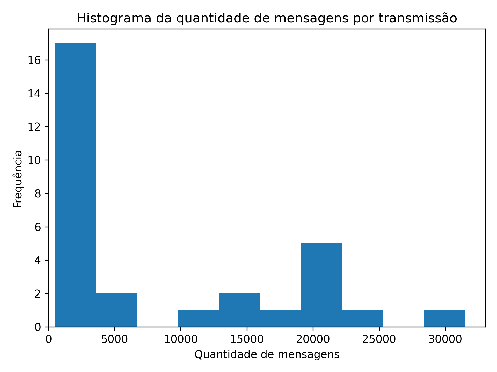
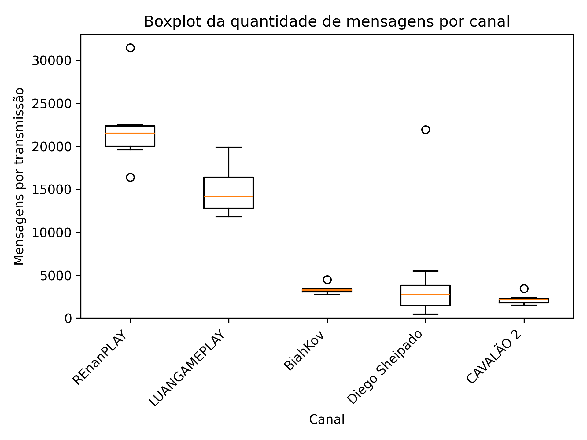
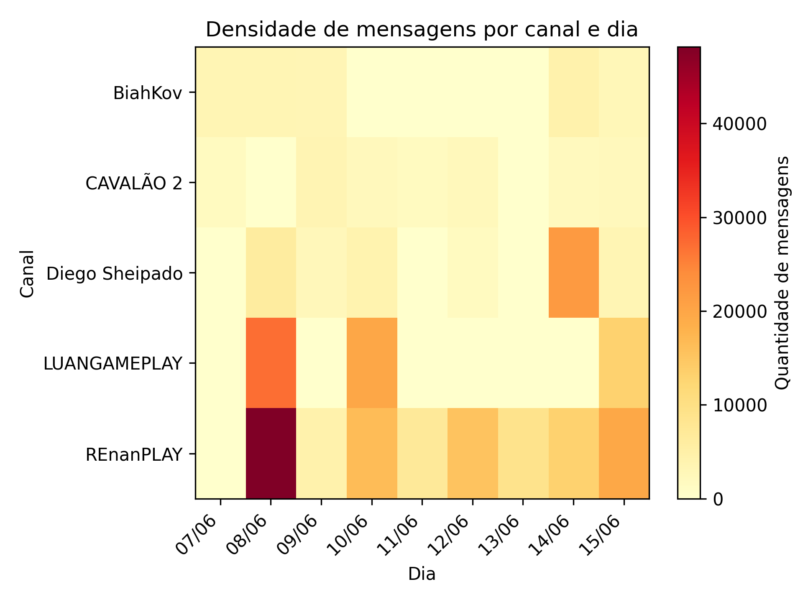
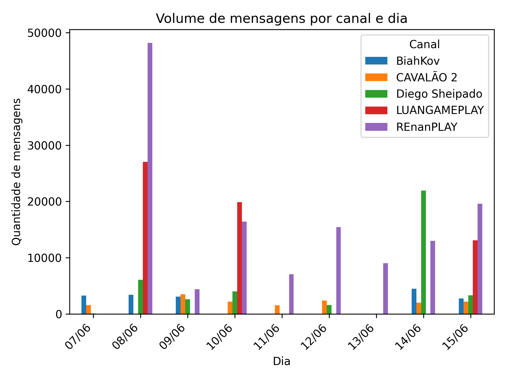
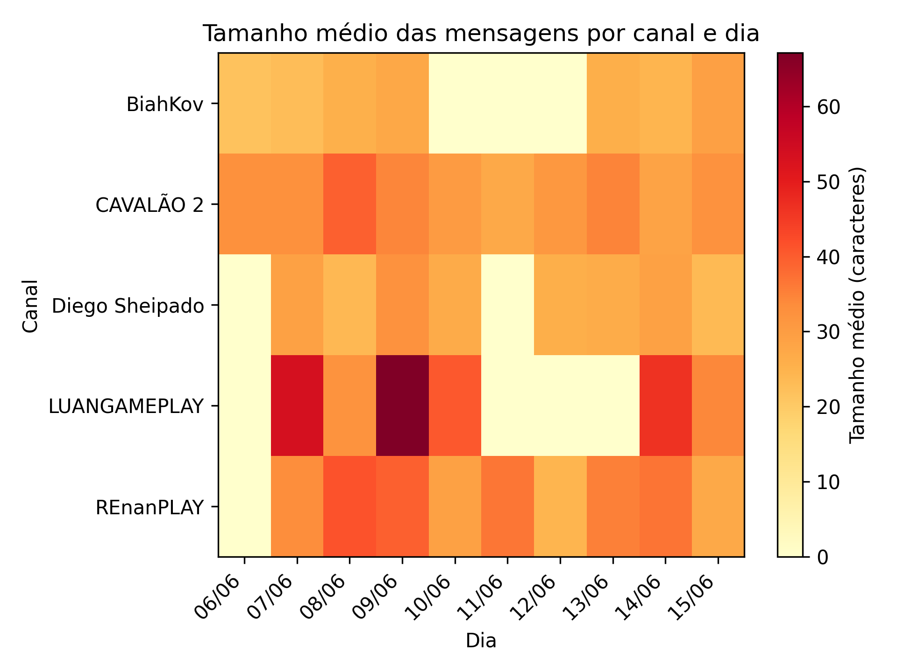
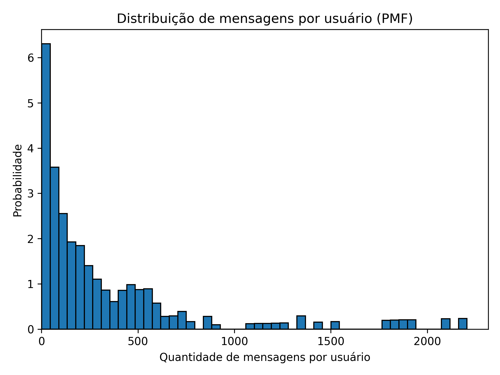

# Análise Exploratória de Chats de Transmissões ao Vivo

Este documento resume os gráficos gerados e apresenta as principais conclusões da análise exploratória sobre o volume de mensagens em transmissões ao vivo de diferentes canais da comunidade gamer no YouTube.

---

## Análise 1: Histograma da quantidade de mensagens por transmissão

  

**O que mostra:**

- A maior parte das transmissões possui até **5.000 mensagens**, mas há casos que ultrapassam **30.000 mensagens**.

**Interpretação:**

- A distribuição exibe uma forte assimetria com cauda longa à direita, indicando que a maioria das transmissões tem engajamento moderado, enquanto algumas apresentam volumes excepcionalmente altos, sugerindo a necessidade de considerar outliers em análises futuras.

---

## Análise 2: Boxplot da quantidade de mensagens por canal

  

**O que mostra:**

- A distribuição da quantidade de mensagens por transmissão, agrupada por canal, ordenada pela mediana decrescente.
- Cada boxplot mostra a mediana, a dispersão (IQR), e possíveis outliers.

**Interpretação:**

- Os canais mostram padrões variados de engajamento, com alguns exibindo maior volume e variabilidade, enquanto outros mantêm transmissões mais homogêneas, destacando a influência de outliers na análise geral.

---

## Análise 3: Volume de mensagens por canal e dia (heatmap)

  

**O que mostra:**

- A intensidade de mensagens enviadas por dia, separada por canal.
- Tons mais escuros representam maior volume de mensagens em determinado dia e canal.

**Interpretação:**

- A visualização revela picos de atividade concentrados em alguns canais e dias, com outros apresentando uma distribuição mais uniforme, sugerindo padrões recorrentes de engajamento.

---

## Análise 4: Volume de mensagens por canal e dia (gráfico de barras)

  

**O que mostra:**

- Comparação direta do volume de mensagens por dia entre os canais.

**Interpretação:**

- Um canal se destaca em volume geral, enquanto outros mostram picos esporádicos, e canais menores mantêm consistência baixa, refletindo diferenças na dinâmica de engajamento.

---

## Análise 5: Tamanho médio das mensagens por canal e dia (heatmap)

  

**O que mostra:**

- O tamanho médio das mensagens enviadas por dia, separado por canal.
- Tons mais escuros indicam mensagens mais longas, enquanto tons claros indicam mensagens mais curtas.

**Interpretação:**

- A análise destaca variações no tamanho médio das mensagens entre canais e períodos, sugerindo que o tipo de interação (reativa ou conversacional) pode influenciar a dinâmica dos chats.

---

## Análise 6: Nuvem de palavras mais frequentes nos chats

## Tabela: 10 Palavras Mais Frequentes

| Palavra         | Frequência |
|-----------------|------------|
| pra             | 5206       |
| vai             | 5047       |
| ai              | 3695       |
| renan           | 3518       |
| kkkkkkkkkkkkkkkk| 3102       |
| opa             | 2930       |
| live            | 2887       |
| tá              | 2881       |
| jogo            | 2636       |
| sheipado        | 2597       |

**Interpretação:**

- A nuvem e a tabela revelam um tom casual e centrado em gaming, com destaque para humor ("kkkkkkkkkkkkkkkk") e menções a streamers, indicando a influência de figuras específicas na interação da comunidade.

---

## Análise 7: Distribuição de mensagens por usuário (PMF)

  

**O que mostra:**

- No eixo X: número de mensagens enviadas por um usuário.
- No eixo Y: a probabilidade (normalizada) de um usuário ter enviado aquela quantidade de mensagens.

**Interpretação:**

- A distribuição apresenta uma forte assimetria, com a maioria dos usuários enviando poucas mensagens e um pequeno grupo de superusuários contribuindo significativamente, sugerindo uma dinâmica de engajamento concentrada.

---

## Análise 8: Comparação entre Canais Grandes e Pequenos

## Tabela: Critério de Classificação

| Critério                | Descrição                                      |
|--------------------------|------------------------------------------------|
| Quantil 60% do volume médio de mensagens por live | Canais com volume médio acima do 60º percentil são classificados como "grandes"; os abaixo são "pequenos". |

## Tabela: Canais Grandes e Pequenos

| Categoria | Canais              |
|-----------|---------------------|
| Grandes   | LUANGAMEPLAY, REnanPLAY |
| Pequenos  | BiahKov, CAVALÃO 2, Diego Sheipado |

## Tabela: Comparação 

| Métrica                        | Grandes  | Pequenos |
|--------------------------------|----------|----------|
| Volume médio por live          | 19302.30 | 3588.40  |
| Mensagens por usuário          | 21.28    | 28.71    |
| Tempo médio entre mensagens (s)| 6.41     | 28.32    |

**Interpretação:**

- Canais grandes apresentam maior volume de mensagens por live e interações mais rápidas, enquanto a atividade por usuário é semelhante, sugerindo que o engajamento total depende do número de participantes.

---

## Análise 9: Comparação entre Streamers Homens e Mulheres

| Métrica                       | Homens    | Mulheres  |
|-------------------------------|-----------|-----------|
| Volume médio por live         | 9912.92   | 3393.60   |
| Mensagens por usuário         | 25.24     | 27.73     |
| Tempo médio entre mensagens (s) | 10.34    | 41.75     |
| Percentual de "kkkk" (%)      | 19.65     | 20.80     |
| Percentual de mensagens com emojis (%) | 2.15    | 3.10      |

**Interpretação:**

- Homens mostram maior volume e dinamismo nos chats, enquanto mulheres têm interações ligeiramente mais espaçadas e maior uso de emojis, com semelhanças no uso de humor, sugerindo diferenças culturais ou de estilo de interação.

---

## Análise 10: Estatísticas Globais por Transmissão

| Variável                  | Média    | Mediana  | Moda    |
|---------------------------|----------|----------|---------|
| quantidade_mensagens      | 8826.30  | 3332.50  | N/A     |
| tamanho_mensagem_médio    | 31.81    | 29.89    | N/A     |
| tempo_médio_entre_msg     | 27.35    | 15.70    | N/A     |

**Interpretação:**

- A análise revela uma variação significativa nas métricas por transmissão, com médias e medianas indicando distribuições assimétricas, especialmente em `quantidade_mensagens` e `tempo_médio_entre_msg`. A ausência de moda aplicável ("N/A") reflete a diversidade única de cada live, sem padrões repetitivos, destacando a necessidade de focar em medidas centrais como média e mediana para capturar as tendências gerais.

---

## Conclusões Práticas

- **Diferenças claras de engajamento** entre os canais.
- Alguns canais se destacam por alto volume de mensagens e devem ser considerados com cuidado na normalização das análises.
- A presença de transmissões com altíssima interação sugere que será importante:
  - Detectar e avaliar os outliers, tratando-os apenas quando forem inconsistentes com o comportamento esperado do conjunto de dados.
  - Levar em conta o canal nas análises futuras, já que ele pode influenciar os resultados e gerar diferenças no volume de mensagens entre as transmissões.
- Canais menores têm distribuições mais concentradas e previsíveis.
- A análise por gênero revela diferenças no dinamismo e uso de emojis, sugerindo variações culturais ou de interação que podem ser exploradas em estudos futuros.

---

> Esta análise é parte da entrega 2 do projeto de Análise e Projeto de Experimentos, integrando dados reais coletados via API do YouTube.